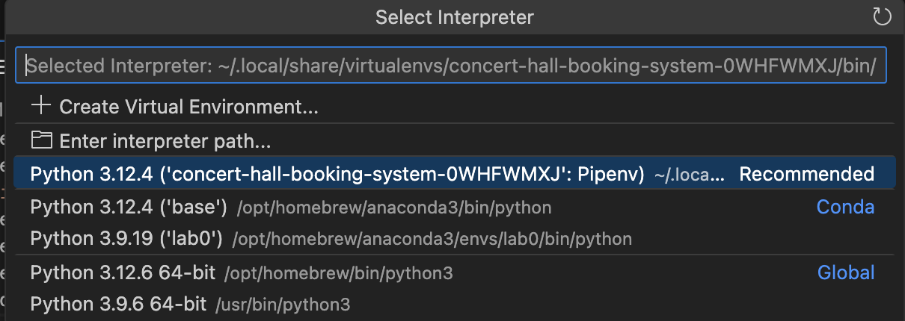

# concert-hall-booking-system

### Getting started

Step 1. Ensure you have python 3.12 and pip installed.

Step 2. Install pipenv to create virtual environment and act as a package manager
`pip install pipenv`

Step 3. Clone the Github repo and cd `concert-hall-booking-system`

Step 4. Run `pipenv install` to create a virtual environment and install dependencies in requirements.txt

Step 5. Run `pipenv shell` to activate the virtual environment 

(To avoid doing this step everytime you want to run the server, use VSCode Command Pallette to select the Python interpreter to the virtual enviroment created for this folder.)

Step 6. Run `python manage.py runserver`

### Additional commands

1. `django-admin startproject config .` was used to create the Django project which holds the settings.py and urls.py

2. `python manage.py startapp <app_name>` is used to create a new application in the project (also need to add it to config.settings.py)